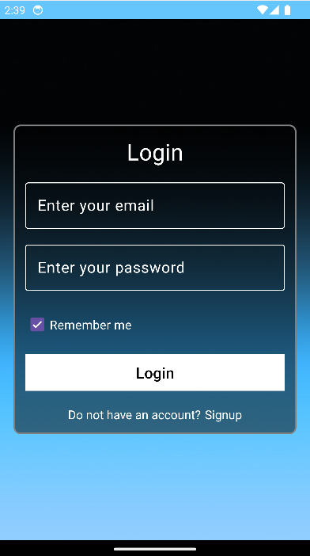
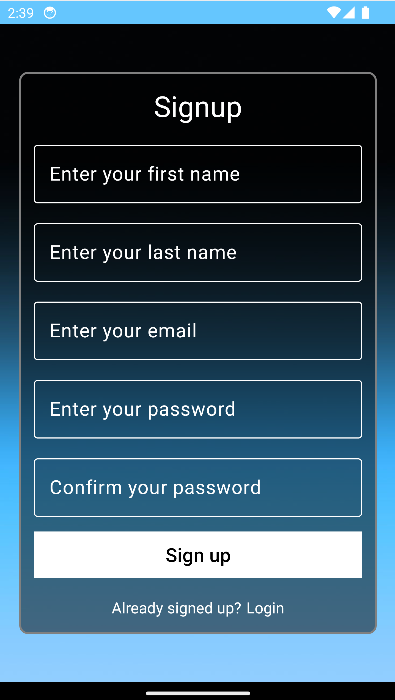
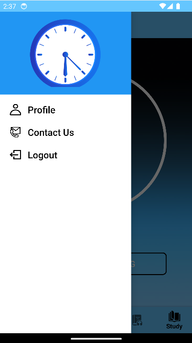
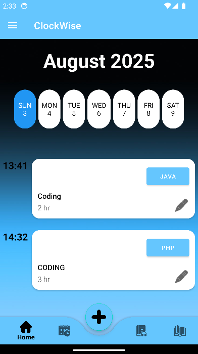
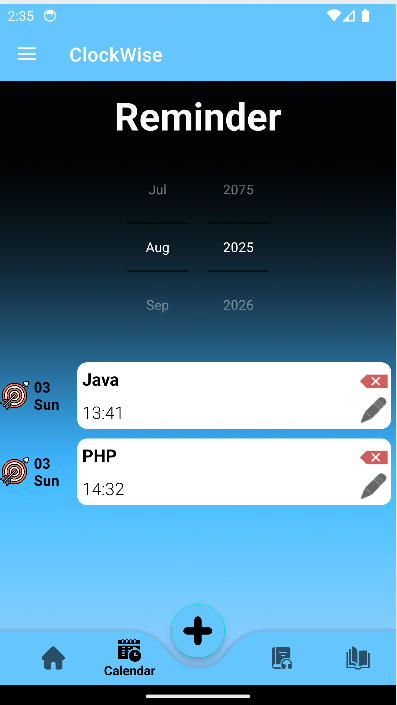
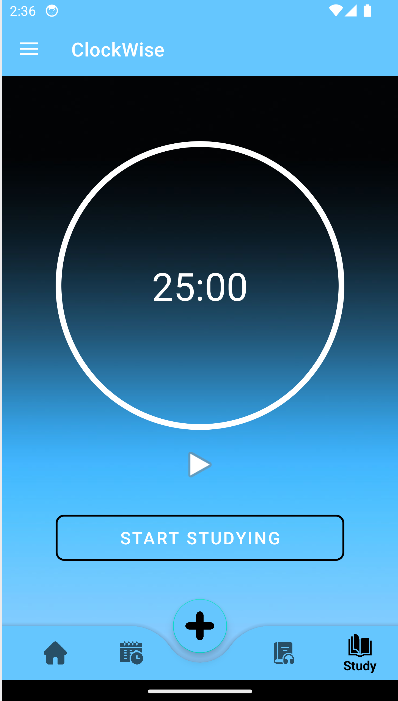
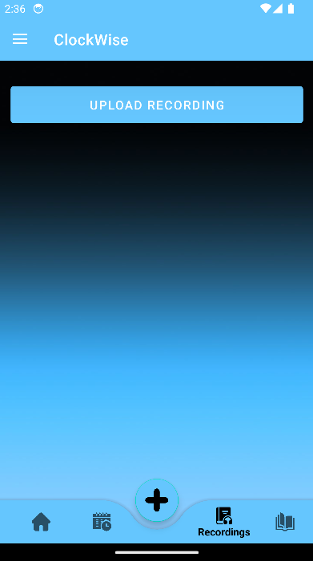
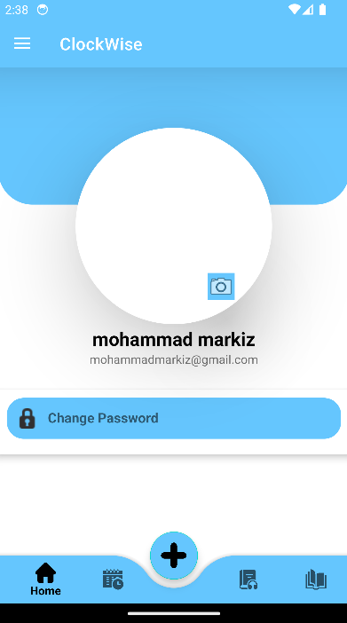
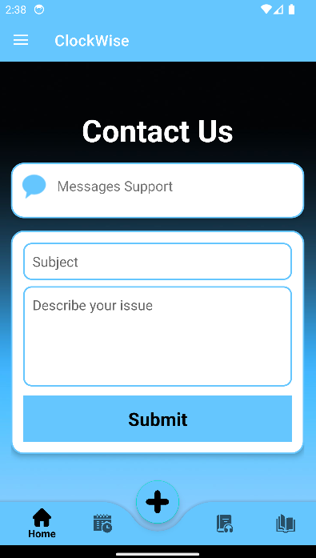

# ClockWise - Mobile Event Management & Study App

## 📱 Overview

ClockWise is a comprehensive Android mobile application designed to help users manage their events, schedule activities, and maintain a productive study routine. The app combines event management, calendar functionality, audio recording capabilities, and a study timer to provide a complete productivity solution.

## 📸 Screenshots

### Authentication & Navigation

*Secure login interface with email validation and remember me functionality*


*User registration with form validation*


*Main app interface with navigation drawer and bottom navigation*

### Event Management

*Weekly overview with current day highlighting and upcoming events*


*Interactive calendar with month/year picker and event filtering*

### Study & Productivity

*25-minute Pomodoro timer with start/stop controls*


*Audio recording management with file upload and playback*

### Settings & Profile

*User profile management and settings*


*Contact form for user support*

---

## ✨ Features

### 🔐 Authentication System
- **User Registration & Login**: Secure user authentication with email validation
- **Remember Me**: Persistent login functionality using SharedPreferences
- **Session Management**: Automatic session handling and logout capabilities

### 📅 Event Management
- **Add Events**: Create new events with name, description, date, start time, and end time
- **Event Calendar**: Interactive calendar view with month/year picker
- **Event List**: View all events in an organized list format
- **Auto-cleanup**: Automatic deletion of past events
- **Floating Action Button**: Quick access to event creation

### 🏠 Home Dashboard
- **Weekly Overview**: Current week display with highlighted current day
- **Event Summary**: Quick view of upcoming events
- **Navigation**: Easy access to all app features via bottom navigation

### 🎯 Study Timer
- **Pomodoro Timer**: 25-minute study timer (1,500,000 milliseconds)
- **Start/Stop Controls**: Simple timer controls with visual feedback
- **Study Session Tracking**: Monitor study time and sessions
- **Visual Indicators**: Play/pause icons for timer state

### 🎙️ Audio Recording Management
- **File Upload**: Upload audio recordings from device storage
- **Recording Library**: View and manage all uploaded recordings
- **Permission Handling**: Proper Android permission management for audio access
- **File Management**: Store and retrieve audio files with metadata

### 🔄 Data Synchronization
- **Offline Support**: Local database storage using Room
- **Cloud Sync**: Synchronization with remote server when internet is available
- **Conflict Resolution**: Smart sync status management (PENDING_ADD, PENDING_EDIT, PENDING_DELETE, SYNCED)
- **Network Detection**: Automatic connectivity checking

### 🎨 User Interface
- **Material Design**: Modern Android Material Design components
- **Navigation Drawer**: Side navigation menu for profile, contact, and logout
- **Bottom Navigation**: Quick access to main features (Home, Calendar, Recordings, Study)
- **Floating Action Button**: Quick event creation
- **Responsive Design**: Adapts to different screen sizes

## 🏗️ Architecture

### Technology Stack
- **Language**: Java 11
- **Platform**: Android (API 28+)
- **Target SDK**: 34
- **Database**: Room (Local SQLite)
- **Network**: Volley for HTTP requests
- **UI Components**: Material Design, RecyclerView, Fragments
- **Image Loading**: Glide for image handling
- **Build System**: Gradle with Kotlin DSL

### Project Structure
```
app/src/main/java/lb/edu/ul/mobileproject/
├── Main.java                    # Main activity with navigation
├── Login.java                   # Authentication activity
├── Signup.java                  # User registration
├── AddEvent.java               # Event creation
├── StudyFragment.java          # Study timer functionality
├── CheckConnection.java        # Network connectivity checker
├── database/                   # Room database components
│   ├── AppDatabase.java
│   ├── Event.java
│   ├── EventDao.java
│   ├── Recording.java
│   └── RecordingDao.java
├── home/                       # Home dashboard
│   ├── HomeFragment.java
│   └── HomeAdapter.java
├── calendar/                   # Calendar functionality
│   ├── CalendarFragment.java
│   └── CalendarAdapter.java
├── recording/                  # Audio recording management
│   ├── RecordingsFragment.java
│   └── RecordingAdapter.java
├── drawer/                     # Navigation drawer components
│   ├── ProfileFragment.java
│   ├── ContactFragment.java
│   └── LogoutFragment.java
└── sync_data/                  # Data synchronization
    ├── StoreData.java
    ├── LoadEvents.java
    └── VolleyCallback.java
```

### Database Schema

#### Event Table
- `id` (Primary Key, Auto-increment)
- `EventName` (String)
- `EventDescription` (String)
- `EventDate` (String, YYYY-MM-DD format)
- `EventStartTime` (String, HH:MM format)
- `EventFinishTime` (String, HH:MM format)
- `DateTime` (String, combined date and time)
- `SyncStatus` (String, sync state)

#### Recording Table
- `id` (Primary Key, Auto-increment)
- `file_name` (String)
- `file_path` (String, URI)

## 🚀 Installation & Setup

### Prerequisites
- Android Studio Arctic Fox or later
- Android SDK API 28+
- Java 11
- Internet connection for initial setup

### Build Instructions

1. **Clone the Repository**
   ```bash
   git clone <repository-url>
   cd MobileProject
   ```

2. **Open in Android Studio**
   - Launch Android Studio
   - Open the project folder
   - Wait for Gradle sync to complete

3. **Configure Server Settings**
   - Update the IP address in `Main.java`:
   ```java
   public static String ip="YOUR_SERVER_IP";
   ```

4. **Build and Run**
   - Connect an Android device or start an emulator
   - Click "Run" in Android Studio
   - The app will install and launch automatically

### Server Requirements
The app requires a PHP-based backend server with the following endpoints:
- `login.php` - User authentication
- `addEvent.php` - Add new events
- `editEvent.php` - Edit existing events
- `deleteEvent.php` - Delete events
- `syncEvent.php` - Synchronize events
- `deleteEvents.php` - Bulk delete events

## 📱 Usage Guide

### Getting Started
1. **Launch the App**: The app opens to the login screen
2. **Create Account**: Tap "Signup" to create a new account
3. **Login**: Enter your credentials and tap "Login"
4. **Grant Permissions**: Allow necessary permissions for audio access

### Managing Events
1. **Add Event**: Tap the floating action button (+) to create a new event
2. **Fill Details**: Enter event name, description, date, and times
3. **Submit**: Tap "Submit" to save the event
4. **View Events**: Navigate to Home or Calendar to view your events

### Using the Study Timer
1. **Navigate to Study**: Tap the study icon in bottom navigation
2. **Start Timer**: Tap "Start Studying" to begin the 25-minute timer
3. **Monitor Progress**: Watch the countdown timer
4. **Stop Timer**: Tap "Stop Studying" to pause or reset

### Managing Recordings
1. **Upload Recording**: Navigate to Recordings tab
2. **Select File**: Tap "Upload Recording" and choose an audio file
3. **View Library**: All uploaded recordings appear in the list
4. **Play Recordings**: Tap on recordings to play them

### Calendar Navigation
1. **Select Month/Year**: Use the pickers to navigate to different months
2. **View Events**: Events for the selected month appear in the list
3. **Filter**: Only events for the selected month/year are displayed

## 🔧 Configuration

### Network Configuration
- Update the server IP address in `Main.java` (line 33)
- Ensure the server endpoints match the expected format
- Configure network permissions in `AndroidManifest.xml`

### Database Configuration
- Room database is automatically created on first launch
- Database name: "Events"
- Version: 1
- Auto-migration enabled

### Permissions
The app requires the following permissions:
- `INTERNET` - For server communication
- `ACCESS_NETWORK_STATE` - For connectivity checking
- `READ_EXTERNAL_STORAGE` - For audio file access (Android < 13)
- `READ_MEDIA_AUDIO` - For audio file access (Android 13+)
- `READ_MEDIA_IMAGES` - For image access (Android 13+)
- `ACCESS_MEDIA_LOCATION` - For media location access
- `POST_NOTIFICATIONS` - For notifications

## 🔄 Data Synchronization

### Sync States
- **PENDING_ADD**: Event created locally, waiting to sync to server
- **PENDING_EDIT**: Event modified locally, waiting to sync to server
- **PENDING_DELETE**: Event marked for deletion, waiting to sync to server
- **SYNCED**: Event synchronized with server

### Sync Process
1. **Offline Creation**: Events created offline are marked as PENDING_ADD
2. **Connection Detection**: App checks for internet connectivity
3. **Bidirectional Sync**: Local changes sync to server, server changes sync to local
4. **Conflict Resolution**: Smart handling of sync conflicts

## 🛠️ Development

### Dependencies
The project uses the following key dependencies:
- **Room**: 2.6.1 for database management
- **Volley**: 1.2.1 for network requests
- **Glide**: 4.12.0 for image loading
- **Material Design**: 1.12.0 for UI components
- **AppCompat**: 1.7.0 for backward compatibility

### Adding New Features
1. Create new Java classes in appropriate packages
2. Update the database schema if needed
3. Add UI components in the layout files
4. Update navigation and permissions as required

### Debugging
- Use Android Studio's built-in debugger
- Check logcat for error messages
- Verify network connectivity and server endpoints
- Test on different Android versions

### Testing
- Unit tests available in `test/` directory
- Instrumented tests in `androidTest/` directory
- Test on multiple device configurations

## 📄 License

This project is developed for educational purposes at the University of Lebanon.

## 👥 Contributing

1. Fork the repository
2. Create a feature branch
3. Make your changes
4. Test thoroughly
5. Submit a pull request

## 📞 Support

For technical support or questions:
- Check the Contact Us section in the app
- Review the code documentation
- Test with different network conditions

## 🔮 Future Enhancements

- Push notifications for event reminders
- Cloud backup and restore
- Multiple user profiles
- Advanced calendar views
- Integration with external calendar services
- Offline mode improvements
- Performance optimizations
- Dark mode support
- Widget support for quick access

---

**Version**: 1.0  
**Last Updated**: 2024  
**Platform**: Android (API 28+)  
**Language**: Java  
**Target SDK**: 34  
**Min SDK**: 28 